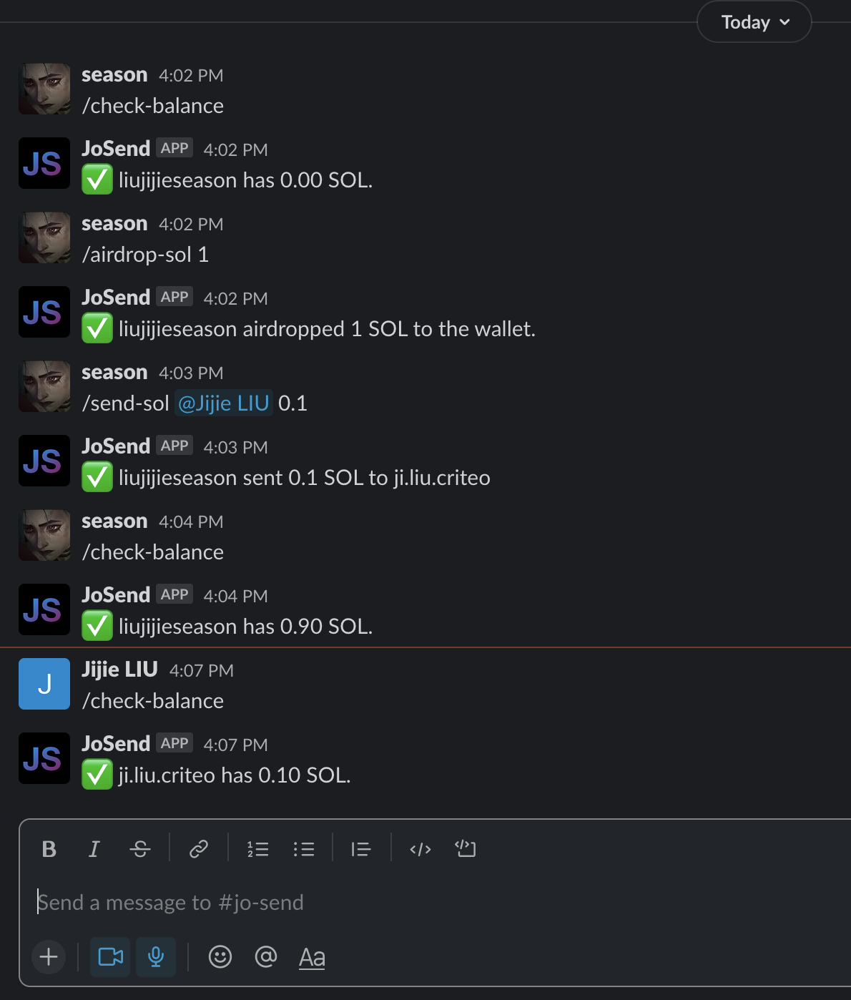
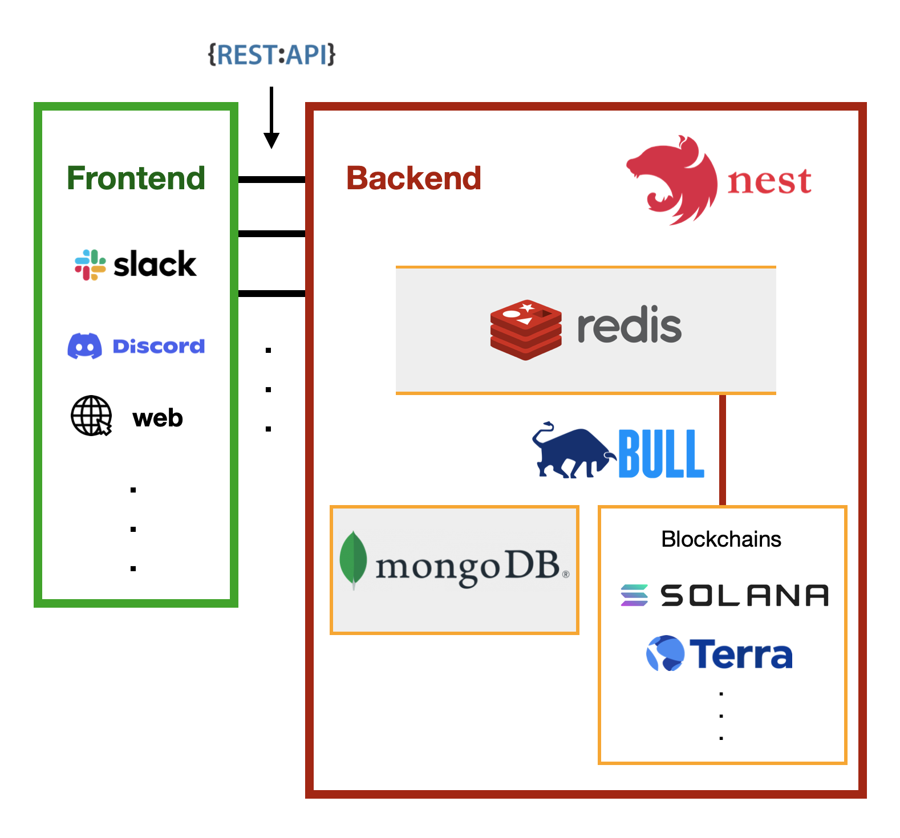

## Demo

Sending crypto as easy as sending messages

## System design

## Supported blockchains

- [x] Solana
- [ ] Terra

## Supported crypto coins/tokens

- [x] SOL
- [ ] UST

## Supported chat applications

- [x] [Slack](./docs/tech-support/slack.md)
- [ ] Discord

## Functionalities

- **Create a wallet for the user automatically**

  When JoSend detects that the user doen't have a wallet in the system, it will create one for him/her.

- **Check user's wallet balance**

- **Send some SOLs between users**

- Airdrop some SOLs to user's wallet (devnet or localhost)

The full endpoints are shown in [http://localhost:3030/api/](http://localhost:3030/api/).

## Documents

- [Contributing](./CONTRIBUTING.md)

- [Developer documentation](./docs/developer.md)

- [Change log](./CHANGELOG.md)
