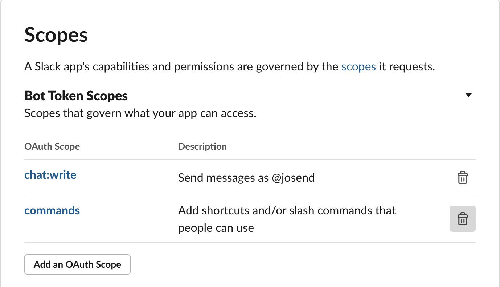
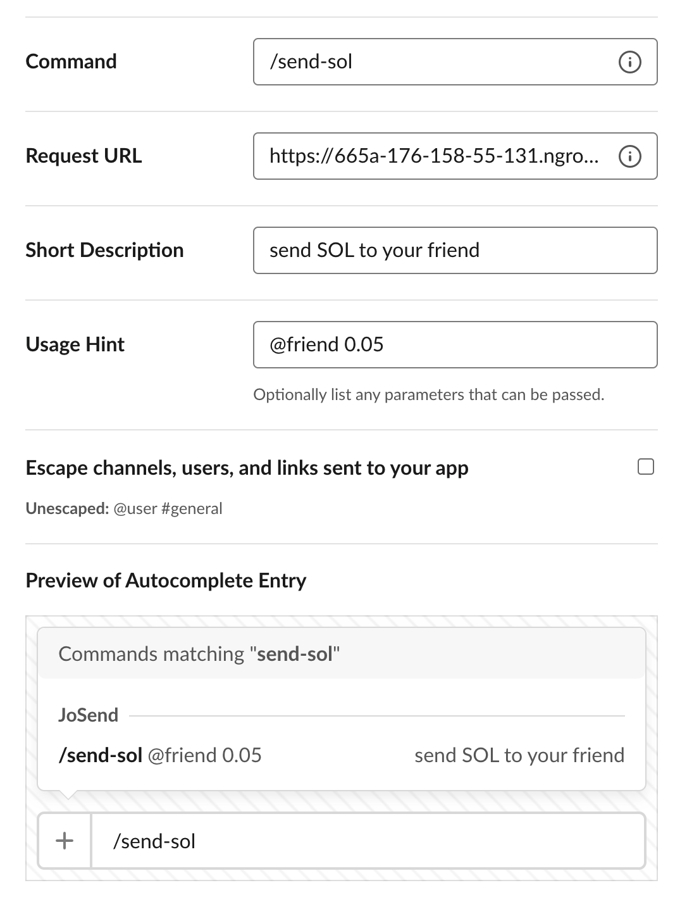

# JoSend Slack App

JoSend uses **slash command** to send requests to the backend, and the backend takes care of all the functionalities, such as creating wallets, sending SOLs, etc. Therefore, this article will focus on how to create a slack slash command app.

## Creating a Slack app

Follow the official tutorial, [Getting started](https://api.slack.com/start/building/bolt-js#start), from [Creating a Slack app](https://api.slack.com/start/building/bolt-js#create) to [Installing your app](https://api.slack.com/start/building/bolt-js#install).

Pay attention to [Requesting scopes](https://api.slack.com/start/building/bolt-js#scopes). We need 2 **Bot Token Scopes**:

- `chat:write`: enable the backend to send the responses to slack

- `commands`: enable slash command.



## Adding Slash command

Since we work on **local machine**, Slack doesn't know the IP address of your device. We need a proxy, [ngrok](https://ngrok.com/). Let's install it.

Once you start your local JoSend, you can start ngrok.

```command
ngrok http 3030
```

Following addresses will appear in the console. You can choose either of them (https is recommended) as the **root URL**.


Now, we can add slash commands. For example, let's create a `/send-sol` command. The request URL is:

```url
https://665a-176-158-55-131.ngrok.io/slack/send-sol
```



## References

- [Slack: Building an app with Bolt for JavaScript](https://api.slack.com/start/building/bolt-js)
- [Slack: Enabling interactivity with Slash Commands](https://api.slack.com/interactivity/slash-commands)
